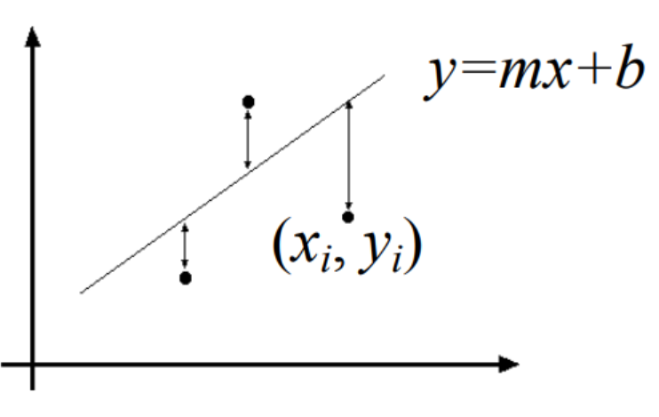
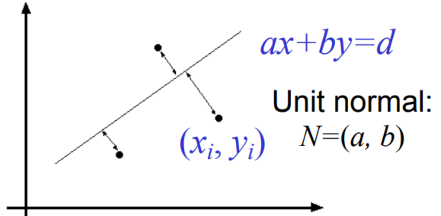
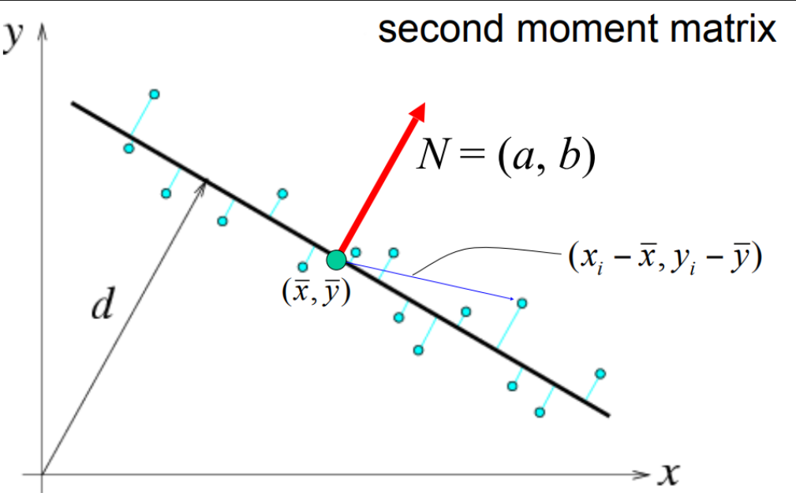
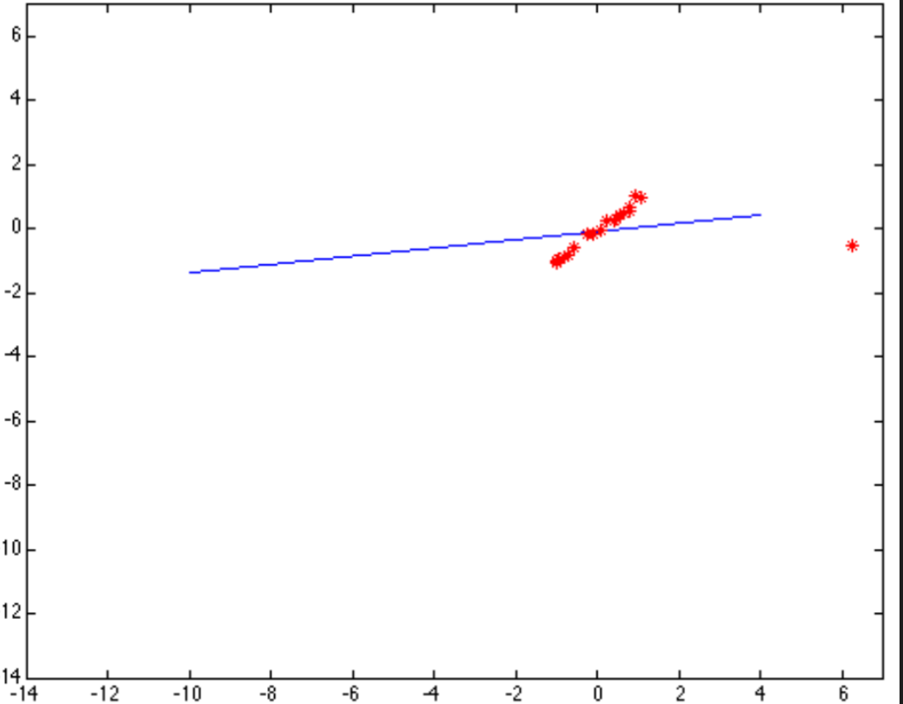
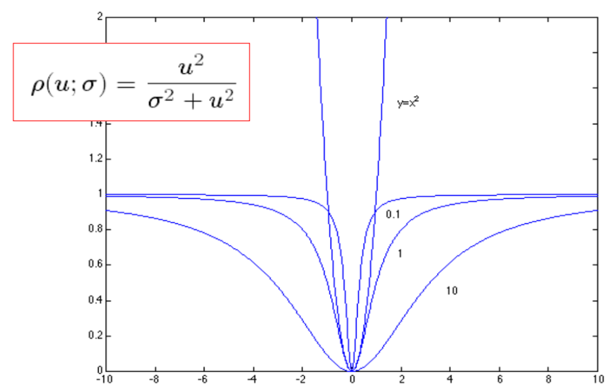
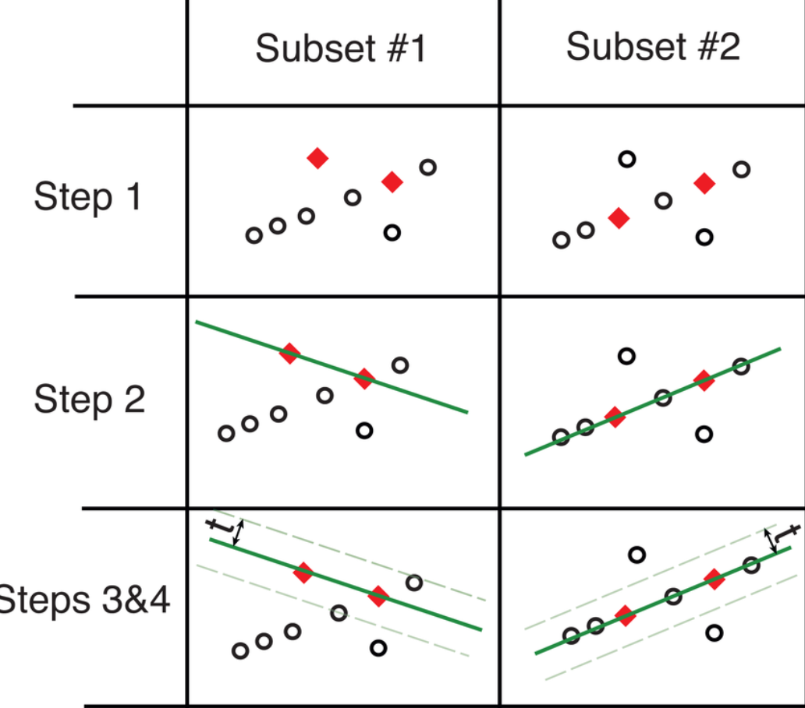

## Fitting
Once we have identified the basic "primitives" in an image—such as edges and interest points—the next step is to combine these low-level elements into larger structures. This process enables us to create a higher-level, more compact representation of the image's features by grouping multiple features according to a simple model. This grouping forms a foundation for understanding and interpreting more complex scenes in computer vision.

### Main issues in Fitting
When we know which points in an image correspond to a specific structure (e.g., points lying on a line), the problem becomes finding the "optimal" parameters for that structure. For instance, if we assume a line model, we need to determine the best parameters for the line equation. Main issues: 
- noise in the measured feature locations
- Extraneous data: clutter (outliers), multiple lines
- Missing data: occlusions 

Overview: 
If we know which points belong to the line, how do we find the "optimal" line parameters? 
- Least squares
What if there are outliers? 
- Robust fitting, RANSAC
What if there are many lines? 
- Voting methods: RANSAC, Hough transform
What if we're not even sure it's a line? 
- Model selection (not covered) 

--- 
### Least squares line fitting

Given different data points $(x_1, y_1)... (x_n, y_n)$, we can model a line with the line equation:

$$y_i = mx_i + b$$

The objective is to find values  for ($m, b$) to minimize the error between the observed data and the line. This error is typically measured by the sum of squared vertical distances from each point to the line:  

$$
E = \sum_{i=1}^n (y -mx_i - b)^2
$$

Rewriting in vector for 

$$
c \text{ where  } Y = \begin{bmatrix} y_1 \\ \vdots \\ y_n \end{bmatrix}
X = \begin{bmatrix} x_1 \\ \vdots \\ x_n \end{bmatrix}
B = \begin{bmatrix} m \\ b \end{bmatrix}
$$

$$
E = ||Y - XB||^2 = (Y-XB)^T(Y-XB) = Y^TY - 2(XB)^TY+(XB)^T(XB) 
$$

we make the derivate and set it to zero

$$
dE/dB = 2X^TXB-2X^TY = 0 
$$

$$
X^TXB = X^TY
$$

#### Problem with "vertical" least squares
Traditional least squares fitting works well if the data errors are purely in the 𝑦-direction (i.e., vertical errors). However, this approach has limitations:

- Sensitivity to Outliers: Least squares fitting can be significantly affected by outliers, which are data points that don't follow the general trend.
- Non-Rotation-Invariance: The solution depends on the coordinate system and is not invariant to rotation. This means that if the image or coordinate axes are rotated, the least squares solution can change, especially for nearly vertical lines.
- Noise in All Directions: If there is noise in both 𝑥 and 𝑦 directions, or if we are uncertain about which points belong to the line, traditional least squares can give suboptimal results.

### Total Least Squares
To address these issues, we use Total Least Squares (TLS). TLS is an extension of least squares that accounts for errors in both the 𝑥 and 𝑦 directions. Instead of minimizing vertical distances, it minimizes the perpendicular distance from each point to the line. This method is more robust to noise in all directions and is invariant to rotations and scaling.

The equation of a line in TLS is given by:

$$
ax + by = d
$$

It depends in three parameters of the line ($a, b, d$). We can also set up $a^2 + b^2 = 1$. It is a good idea because there'll never be a case where $a, b$ will be zero so this way we avoid degenerate cases.  

This constraint ensures that the vector $(a,b)$ represents the direction perpendicular to the line, often called the **unit normal** of the line. 
Our objective in TLS is to find values of ($a, b, d$) that minimize the sum of squared perpendicular distances from each point to the line.

$$
E = \sum^n_{i=1} (ax_i + by_i - d)^2
$$

#### Optimization and solution
To solve this, we set up an optimization problem where we minimize the total error with the constrain $a^2 + b^2 = 1$. If we solve first for $d$ in terms of $a$ and $b$, we get: 

$$
d = a \bar x + b\bar y
$$

where $\bar x$ and $\bar y$ are the mean values of the $x$ and $y$ coordinates.

$$
d = \frac {a}{n} \sum^n_{i=1} x_i + \frac{b}{n} \sum^n_{i=1}y_i = a \bar x + b\bar y
$$

If we put this term back into the previous equation 

$$
E = \sum^n_{i=1} (a(x_i - \bar x) + b(y_i - \bar y))^2
$$

Solving this in matrix vector form as matrices, where $a,b$ is a 2D vector that we call $N$ and all of the differences (e.g. $x_1 - \bar x$), which is our data as a matrix $U$ and the L2 transport norm is $(UN)^T(UN)$

$$
E = \left\|\left[
\begin{array}{cc}
x_1 - \overline{x} & y_1 - \overline{y} \\
x_n - \overline{x} & y_n - \overline{y} \\
\end{array}
\right] 
\left[
\begin{array}{c}
a \\
b \\
\end{array}
\right] \right\|^2
 = (UN)^T(UN) 
 $$

If we take the derivate with respect to $N$ (this is to say with respect $a,b$) we get the expression and we want it to be equal to 0 (at the minimum) 
The solution, subject to the norm that $a,b$ or $N$ being equal to 1: is the eigenvector of $U^TU$ associated with the smallest eigenvalue (least squares solution to *homogeneous linear systems*). 

$$
U = \left[
\begin{array}{cc}
x_1 - \overline{x} & y_1 - \overline{y} \\
... & ... \\
x_n - \overline{x} & y_n - \overline{y} \\
\end{array}
\right]
$$

$$
U^TU = \left[
\begin{array}{cc}
\sum^n_{i=1} (x_i - \overline{x})^2 & \sum^n_{i=1} (x_i - \overline x)(y_i - \overline{y}) \\
\sum^n_{i=1} (x_n - \overline{x})(y_i - \overline y) & \sum^n_{i=1}(y_i - \overline{y})^2 \\
\end{array}
\right]
$$

In the final part, we calculate the **perpendicular distance** from each point to the line. This distance represents how far each data point deviates from the line model in the shortest path (i.e., perpendicular to the line). Minimizing these distances aligns the model with the data more accurately than vertical distances alone, especially when there is noise in all directions. This approach is particularly valuable in computer vision, where feature points often have positional uncertainties in both ($x$) and ($y$) coordinates.

By minimizing these perpendicular distances, we achieve a fitting that is less sensitive to orientation, more resilient to noise in both directions, and robust against outliers. This makes total least squares a preferred method in computer vision tasks, where data often comes with significant uncertainties and noise.

#### Unit Normal
The unit normal vector

$$
N =\left[\begin{array}{c}
a \\
b \\
\end{array}
\right]
$$

is crucial because it represents the direction perpendicular to the line. By constraining $a^2 + b^2 = 1$ we ensure that $N$ has unit length, which simplifies the calculations and maintains stability in the solution. The direction of $𝑁$ gives the orientation of the line in a rotation-invariant way.  

### Least squares fit with outliers
One of the main problems with this method is its highly sensitivity to outliers. In this example we can see how the presence of a single outlier affects the line. 

#### Robust estimators
A general approach to solve this issue is to use **Robust estimators** to find model parameters $\theta$ that minimize: 

$$
\sum_i \rho(r_i(x_i, \theta); \sigma)
$$

The robust function $\rho$ behaves like squared distance for small values of the residual $u$ but saturates for larger values of $u$. 

Robust fitting is a **non-linear** optimization problem that must be solved iteratively. Therefore, one of the differences between this method and TLS or LS is that **requires an iterative method**. 
One thing we could do is use LS solution for initialization. 
This approach works well for a few outliers, but not for many
#### RANSAC
Another approach that is more robust than using the *robust estimators* is [[RANSAC]] which stands for Random Sample Consensus. As we saw, Robust fitting can deal with a few outliers, but not many. For this RANSAC is a better option. 
1. Choose a small subset of points uniformly at random 
2. Fit a model to that subset (e.g. Using LS)
3. Find all remaining points that are "close" to the model and reject the rest as outliers.
4. Do this many times and choose the best model. 

In this example we take a random subset with enough points to fit our model (Using LS we only need 2 points), we fit the model, find the remaining points that are close and reject the outliers. And we do this for every subset until we are satisfied. In this example is clear that subset #2 is a better model than Subset #1 

### RANSAC for line fitting

Algorithm
Repeat $N$ times: 
• Draw $s$ points uniformly at random 
• Fit line to these $s$ points 
• Find inliers to this line among the remaining points (i.e., points whose distance from the line is less than $t$) 
• If there are $d$ or more inliers, accept the line and refit using all inliers

#### Choosing the parameters
• **Initial number of points $s$.** 
Typically minimum number needed to fit the model 
**• Distance threshold $t$** 
Choose $t$ so probability for inlier is $p$ (e.g. 0.95) 
Zero-mean Gaussian noise with std. dev. $σ: t^2=3.84σ^2$ 
**• Number of samples $N$**
Choose $N$ so that, with probability $p$, at least one random sample is free from outliers (e.g. p=0.99) (outlier ratio: e)
 $N = \text{log} (1-p)/\log(1-(1-e)^s)$.

*Proportion of outliers $e$*

| s   | 5%  | 10% | 20% | 25% | 30% | 40% | 50% |
| --- | --- | --- | --- | --- | --- | --- | --- |
| 2   | 2   | 3   | 5   | 6   | 7   | 11  | 17  |
| 3   | 3   | 4   | 7   | 9   | 11  | 19  | 35  |
| 4   | 3   | 5   | 9   | 13  | 17  | 34  | 72  |
| 5   | 4   | 6   | 12  | 17  | 26  | 57  | 146 |
| 6   | 4   | 7   | 16  | 24  | 37  | 97  | 293 |
| 7   | 4   | 8   | 20  | 33  | 54  | 163 | 588 |
 
• **Consensus set size $d$**:  Should match expected inlier ratio

#### RANSAC PROS AND CONS

Pros:
- Simple and general
- Applicable to many different problems
- Often works well in practice
Cons:
- Lots of parameters to tune
- Doesn't work well for lower inlier ratios (too many iterations, or can fail completely)
- Can't always get a good initialization of the model based on the minimum number of samples

### Self-Check Questions
• How does the least-squares fitting of a line work? What is the mathematical
formulation and its solution?

• What is a limitation of least-squares?

• How does total least squares solve that limitation? Derive the mathematical
formulation

• How does RANSAC work?

• What is the main purpose of RANSAC?

• What are advantages and disadvantages of RANSAC?