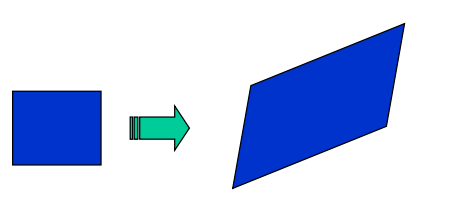
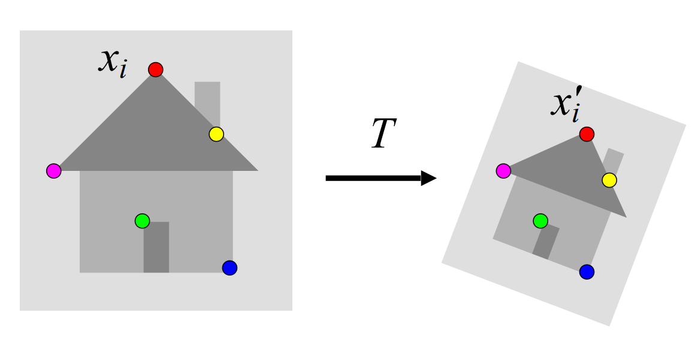
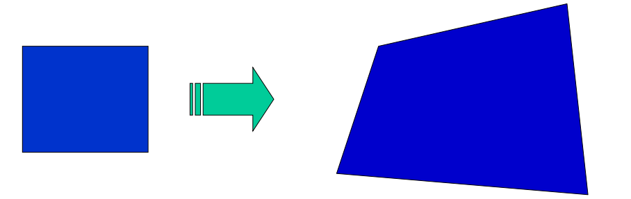

## Image Alignment in Computer Vision
Aligning images involves finding overlapping regions to "stitch" them together. This is essential for applications such as panorama stitching, 3D reconstruction, and object recognition. A straightforward method of alignment might be to match pixel intensities directly, but this approach is unreliable. Pixel values can differ significantly even in overlapping areas due to changes in lighting, viewpoint, or noise, making exact matching of pixel intensities ineffective.

To address this, two main approaches for image alignment are used:

**Direct (Pixel-Based) Alignment:** This approach seeks an alignment where most of the pixel intensities agree between images. It can work well when intensity variations are minimal, but it often fails when there are strong lighting or viewpoint differences.

**Feature-Based Alignment:** Instead of relying on pixel values, this method extracts distinctive features from both images and matches these features. It is much more robust to variations in intensity, scale, and viewpoint.

### Alignment as a Fitting Problem
Image alignment can be framed as a model-fitting problem. We aim to find a model $𝑀$ that minimizes the residuals between observed features and the model's predictions. 

$$
\sum_i \text{residual} (x_i, M)
$$

Specifically, for feature-based alignment, we find a transformation 𝑇 that minimizes the residuals between matched features in two images:

$$ \sum_i \text{residual} (T(x_i), x'_i)$$

## 2D transformation models: 
Various transformation models can be used for image alignment:

- **Similarity Transformation**: Involves translation, rotation, and scaling.

- **Affine Transformation**: Can handle shear and non-uniform scaling. Often used for planar objects with orthographic cameras.

- **Projective Transformation (Homography):** Captures the mapping between two views of a planar surface or the same scene from two cameras with a shared optical center.

### Affine Transformations

Affine transformations are a common first step in aligning images with roughly planar objects and approximately orthographic views. They can be fitted using linear least squares and provide an effective approximation before fitting more complex models.

In an affine transformation, the relationship between corresponding points is linear. Assuming we know the correspondences, we can express the transformation as:
$$
\begin{bmatrix} x_i' \\ y_i' \end{bmatrix} = \begin{bmatrix} m_1 & m_2\\ m_3 & m_4 \end{bmatrix} \begin{bmatrix} x_i \\ y_i \end{bmatrix} + \begin{bmatrix} t_1 \\ t_2\end{bmatrix}
$$

This equation is true for ALL the points. In order to solve this we have to layout in a way that resembles a linear transformation. For that we do: 

$$
\begin{bmatrix}
\vdots & \vdots & \vdots & \vdots & \vdots & \vdots \\
x_i & y_i & 0 & 0 & 1 & 0 \\
0 & 0 & x_i & y_i & 0 & 1 \\
\vdots & \vdots & \vdots & \vdots & \vdots & \vdots \\
\end{bmatrix}
\begin{bmatrix}
m_1 \\
m_2 \\
m_3 \\
m_4 \\
t_1 \\
t_2 \\
\end{bmatrix}
=
\begin{bmatrix}
\vdots \\
x_i' \\
y_i' \\
\vdots \\
\end{bmatrix}
$$

Now we have a linear system with six unknowns. Each match gives us two linaerly independent equations: need at least three to solve for the transformation parameters 

### Homography
A homography is a plane projective transformation that can map any quadrilateral to another quadrilateral. It is used to describe the transformation between two views of a planar surface or when two images are taken from cameras with the same optical center.

Homographies are useful in applications like panorama stitching, where multiple images are aligned to create a seamless wide-angle view.

 
#### Fitting a homography
To represent the transformation, we use [Homogeneous coordinates](https://afloresep.github.io/computer-vision/Projection-Models/)

$$
\lambda \begin{bmatrix} x'_i \\ y'_i \\ 1 \end{bmatrix} =
\begin{bmatrix} h_{11} & h_{12} & h_{13} \\ h_{21} & h_{22} & h_{23} \\ h_{31} & h_{32} & h_{33} \end{bmatrix}
\begin{bmatrix} x_i \\ y_i \\ 1 \end{bmatrix}
$$
 
This scalar $\lambda$ changes for every point while the rest of parameters ($H$) are the same. A way to get rid of it is the following: 

We write the above equation as 

$$
 \lambda \mathbf{x}'_i = \mathbf{H} \mathbf{x}_i
$$
 
Then we take the cross product between $x'$ and $Hx_i$ we should be equal to 0 -because the are two vectors that are proportional to $\lambda$ and hence parallel. 

$$
\mathbf{x}'_i \times \mathbf{H} \mathbf{x}_i = 0
$$
 
This equation can be written as: 
$$
\begin{bmatrix} x'_i \\ y'_i \\ 1 \end{bmatrix} \times
\begin{bmatrix} \mathbf{h}_1^T \mathbf{x}_i \\ \mathbf{h}_2^T \mathbf{x}_i \\ \mathbf{h}_3^T \mathbf{x}_i \end{bmatrix} =
\begin{bmatrix} y'_i \mathbf{h}_3^T \mathbf{x}_i - \mathbf{h}_2^T \mathbf{x}_i \\ \mathbf{h}_1^T \mathbf{x}_i - x'_i \mathbf{h}_3^T \mathbf{x}_i \\ x'_i \mathbf{h}_2^T \mathbf{x}_i - y'_i \mathbf{h}_1^T \mathbf{x}_i \end{bmatrix}
$$

$$
\begin{bmatrix} 0^T & -\mathbf{x}_i^T \\ \mathbf{x}_i^T & 0^T \\ -y'_i \mathbf{x}_i^T & x'_i \mathbf{x}_i^T \end{bmatrix}
\begin{pmatrix} \mathbf{h}_1 \\ \mathbf{h}_2 \\ \mathbf{h}_3 \end{pmatrix} = 0
$$

This yields three equations, but only two are linearly independent.

## Finding Correspondences
### Robust feature-based alignment
Previously, we assumed that correspondences (matching features) between the two images were known. In real scenarios, we don’t have this ground-truth information. We need to detect distinctive points in each image and match them based on appearance and geometry.

**Algorithm to Align**
1. Extract features
2. Compute *putative* matches
3. Loop:
    - Hypothesize Transformation T (Affine or Homology)
    - Verify transformation

**GENERATING PUTATIVE CORRESPONDENCES** 
To generate putative correspondences, we first detect distinctive points in each image. For each point, we compute a vectorized descriptor that captures its appearance in a way that’s invariant to certain transformations (e.g., rotation, scale). Matching is then performed based on similarity between these descriptors. 

#### Feature Descriptors
Feature descriptors encode the appearance around a point. The simplest descriptor is a vector of raw pixel intensities. To compare two such vectors, we can use: 
- Sum of squared differences (SSD). Not invariant to intensity change 

$$
SSD(u, v) = \sum_i (u_i - v_i)^2
$$

- Normalized correlation: Invariant to affine intensity change

$$
\rho(u,v) = \frac{\sum_i(u_i - \bar u)(v_i - \bar v)}{\sqrt {(\sum_j (u_j - \bar u)^2) (\sum_j (v_j - \bar v)^2)}}
$$

#### Disadvantage of intensity vectors as descriptors
Descriptors based on raw intensity values are sensitive to small deformations, such as slight shifts or rotations. This can significantly affect the matching score, making them unsuitable for robust matching.

#### Feature descriptors: SIFT
The Scale-Invariant Feature Transform (SIFT) is a more sophisticated descriptor designed to handle changes in scale, rotation, and minor deformations.
To compute a SIFT descriptor: 
- Divide patch into 4x4 sub-patches
- Compute histogram of gradient orientatios (8 reference angles) inside each sub-patch
- Resulting descritpro. 4x4x8 = 128 dimensions

. Advantage over raw vectors of pixel values
- Gradient less sensitive to illumination change
- Pooling of gradients over the sub-patches achieves robustness to small shifts, but still preserves some spatial information. 

### Feature matching and RANSAC

Once we have descriptors for each feature, we generate putative matches by identifying the closest descriptors between images. Since not all matches are correct (some are outliers), we use RANSAC (Random Sample Consensus) to estimate a robust transformation by rejecting outlier

Here the RANSAC model, saw on [fitting](https://afloresep.github.io/computer-vision/fitting/), comes in handy since we will be facing a lot of outliers. 

RANSAC loop:
1. Randomly select a seed group of matches
2. Compute transformation from seed group
3. Find inliers to this transformation
4. If the number of inliers is sufficiently large, re-compute
least-squares estimate of transformation on all of the
inliers.

Keep the transformation with the largest number of inliers. 

### Self-Checking Questions

• How does alignment/registration relate to fitting?

• How can one compute the affine transformation between two images?

• What is a homography?

• How can one compute the homography between two images?

• When is the homography the exact transformation between two views of a scene?

• Describe how to apply RANSAC method to image alignment. 
