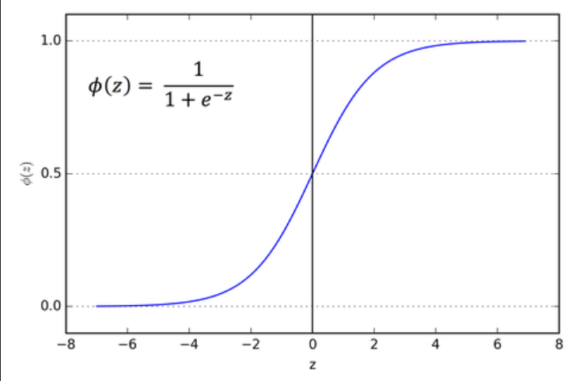

Classification is used to predict a _discrete label_. The outputs fall under a finite set of possible outcomes. Many situations have only two possible outcomes. This is called _binary classification_ (True/False, 0 or 1) 

There are also two other common types of classification: _multi-class classification_ and _multi-label classification_.

Multi-class classification has the same idea behind binary classification, except instead of two possible outcomes, there are three or more.
To perform these classifications, we use models like Naïve Bayes, K-Nearest Neighbors, SVMs, as well as various deep learning models.

## Logistic regression

We shouldn't address the classification problem ignoring the fact that $y$ is discrete-valued (i.e. $y \in$ {$0,1$}). That is why instead of the old linear regression algorithm to try to predict $y$ given $x$ we will choose a **logistic function** or **sigmoid function**

$$
g(z) = \frac{1}{1+e^{-z}} \   \ \ \text {(general formula for sigmoid function)}
$$

thus, 

$$
h_\theta (x) = g(\theta^Tx)  = \frac{1}{1+e^{-\theta^Tx}}
$$

Notice that $g(z)$ tends towards 1 as $z → ∞$, and $g(z)$ tends towards 0 as $z → −∞$. Moreover, $g(z)$, and hence also $h(x)$, is always bounded between 0 and 1. As before, we are keeping the convention of letting $x_0 = 1$, so that 

$$
\theta^Tx = \theta_0 +\sum_{j=1}^d \theta_jx_j
$$

Let us assume that the probability of y=1 given $x$ and $\theta$ is our prediction. 

$$
\begin{align*} P(y=1 | x;\theta) = h_\theta(x)
\\P(y=0 | x;\theta) = 1 - h_\theta(x)
\end{align*}
$$

This can be written more compactly as 

$$
p(y | x; \theta) = (h_\theta(x))^y(1-h_\theta (x))^{1-y}
$$

If $y = 1$, the term becomes:

$$
  p(y = 1 | x; \theta) = (h_\theta(x))^1 (1 - h_\theta(x))^0 = h_\theta(x)
$$

which matches the desired probability for $y$ = 1.
  
If $y = 0$, the term becomes:

$$
  p(y = 0 | x; \theta) = (h_\theta(x))^0 (1 - h_\theta(x))^1 = 1 - h_\theta(x)
$$

  which matches the desired probability for $y = 0$.

### Application: Likelihood Function
In logistic regression, we are typically interested in maximizing the likelihood of observing the data. If we have multiple observations $(x_i, y_i)$, the [[likelihood function]] would be the product of individual probabilities for all data points (remember [[Independent and identically distributed|IID]]):

$$
L(\theta) = \prod_{i=1}^n p(y_i | x_i; \theta)
$$

And to make optimization easier, we usually work with the **log-likelihood**:

$$
\log L(\theta) = \sum_{i=1}^n \left[ y_i \log h_\theta(x_i) + (1 - y_i) \log (1 - h_\theta(x_i)) \right]
$$

This is what logistic regression attempts to maximize to find the best parameters $\theta$.

### Newton's method
So far we've seen only one method for the [[optimization]] (minimization) of a function, [[Gradient Descent]]. 

Newton's method is an optimization algorithm that uses second-order information about the function (i.e., the Hessian matrix) to update the solution in each iteration. Here's how it works:

1. **Taylor Expansion**: Newton's method approximates the function $f(x)$ around the current point $x_t$ using a second-order Taylor expansion:
   
$$
   f(x) \approx f(x_t) + \nabla f(x_t)^T (x - x_t) + \frac{1}{2} (x - x_t)^T H(x_t) (x - x_t)
$$

   where $\nabla f(x_t)$ is the gradient at $x_t$ and $H(x_t)$ is the Hessian (matrix of second-order partial derivatives).

2. **Optimal Step Size**: The optimal step size (or the new point $x_{t+1}$) can be found by solving for the point that minimizes the second-order approximation of the function. The update rule for Newton's method is:
   
   $$
   x_{t+1} = x_t -
   \frac{\nabla f(x_t)}{H(x_t)}
   $$
   
   In other words, the next point is obtained by moving in the direction of the negative gradient, scaled by the inverse of the Hessian matrix.

3. **Quadratic Convergence**: Newton's method typically converges much faster than gradient descent because it incorporates curvature information (via the Hessian). When the function is well-approximated by a quadratic function near the minimum, the method can converge in very few iterations.

4. **Hessian Matrix**: The key distinction between Newton's method and gradient descent is the use of the Hessian matrix. This gives more precise direction and step size, making the method **second-order**, in contrast to the **first-order** gradient descent that only relies on gradient information.

5. **Drawbacks**: 
   - **Computational Cost**: Computing the Hessian and its inverse can be computationally expensive, especially for high-dimensional problems.
   - **Ill-Conditioned Hessians**: If the Hessian is not positive definite (or is close to singular), Newton's method can fail or give undesirable results. Regularization techniques may be required in such cases.
