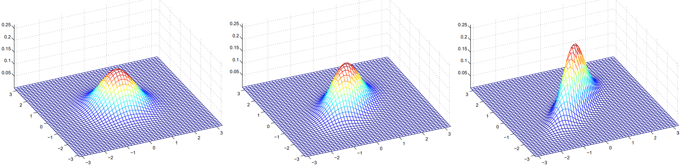

# Generative Learning algorithms

So far, we've mainly been talking about learning algorithms that model the conditional distribution of $y$ given $x$. For instance, logistic regression modeled $p(y \mid x;\theta)$ as $h_\theta(x) = g(\theta^Tx)$ where $g$ is the sigmoid function. 

Consider a classification problem in which we want to learn to distinguish between elephants (y = 1) and dogs (y = 0), based on some features of an animal. Given a training set, an algorithm like logistic regression or the perceptron algorithm (basically) tries to find a straight line that separates the elephants and dogs. Then, to classify a new animal as either an elephant or a dog, it checks on which side of the decision boundary it falls, and makes its prediction accordingly

### GLM approach

In a generative learning algorithm, the focus is on modeling how the data is generated, or what the data looks like, for each possible class. This is done by learning the joint probability distribution $p(x,y)$ where:

- $x$ represents the features (like the characteristics of an animal: size, color, etc.).
- $y$ represents the label (e.g., whether the animal is a dog or an elephant).

Algorithms that try to learn $p(y \mid x)$ directly (such as logistic regression), or algorithms that try to learn mappings directly from the space of inputs $\mathcal{X}$ to the labels $\{0,1\}$, (such as the perceptron algorithm) are called **discriminative learning algorithms.**. In these algorithms we try to predict $y$ (price of a house) given a some $x$ (area, nº beds...).  

Instead, these algorithms are called **generative** learning algorithms.
The idea is to model how likely a certain set of features $x$ is for each class (dog or elephant). You would first model:

- $p(x \mid y = 0)$: The distribution of features for dogs.
- $p(x \mid y = 1)$: The distribution of features for elephants.

In other words, given some $y$ (house prices), try to predict the number of bedrooms, area... 
This is typically an easier problem to solve than the discrimitative way (i.e. $p(y \mid x)$).

Now, how do we get $p(y \mid x)$? With Bayes, of course. 

### Bayes' Theorem
We can use **Bayes' theorem** to predict which class $y$ a new observation belongs to, given the features $x$.

$$
p(y \mid x) = \frac{p(x\mid y)p(y)}{p(x)}
$$
Where: 

- $p(y∣x)$ is the **posterior probability**: the updated probability of $y$ given the observed data $x$.
- $p(x∣y)$ is the **likelihood**: the probability of observing the features $x$ given that the class is $y$ (e.g., dog or elephant).
- $p(y)$ is the **prior**: the overall probability of a particular class (e.g., how common are dogs vs. elephants).
- $p(x)$ is the marginal likelihood: the overall probability of observing the features $x$, summed over all possible values of $y$.

Here, the denominator is given by $p(x) = p(x\mid y = 1)p(y = 1) + p(x\mid y = 0)p(y = 0)$ (you should be able to verify that this is true from the standard properties of probabilities), and thus can also be expressed in terms of the quantities $p(x|y)$ and $p(y)$  that we’ve learned. 

$$
\text{arg max}_y p(y \mid x) = \text{arg max} \frac {p(x \mid y) p(y)}{p(x)}
$$
Actually, if were calculating $p(y \mid x)$ in order to make a prediction, then we don’t actually need to calculate the denominator, since $p(x)$ is a scalar is only changing the magnitude (height of the posterior) but we're taking the argument. So

$$
\text{arg max}_y p(y \mid x) = \text{arg max} p(x \mid y) p(y)
$$

## Gaussian discriminant analysis

The first generative learning algorithm that we’ll look at is Gaussian discriminant analysis (GDA). In this model, we’ll assume that $p(x \mid y)$ is distributed according to a multivariate normal distribution. 
For example, let's take the case for a binary classification problem using Bernoulli. Here: 

- $y \in \{ 0, 1\}$ 
- $p(y)$ = Bernoulli ($\phi$)
- $x \mid y = 0$ is defined by a Gaussian distribution: $\sim \mathcal{N} (\mu_0, \sum)$
- $x \mid y = 1$ is defined by a Gaussian distribution: $\sim \mathcal{N} (\mu_1, \sum)$

If we plotted our generated $x$, assuming 2D, it would look something like this: 

Here we can see $\mu_0$ in the left and $\mu_1$ on the right, the line will help classify any new point to either 0 or 1 depending on where the point lands. 

### The multivariate normal distribution
Lets talk briefly about the properties of multivariate normal distributions before moving on to the GDA model itself.

The multivariate normal distribution is $n$-dimensions, also called the multivariate Gaussian distribution, is parameterized by a **mean vector** $\mu \in \mathbb{R}^n$ and a **covariance matrix** $\sum \in \mathbb{R}^{n \times n}$, where $\sum \geqq 0$ is symmetric and positive semi-definite. Also written "$\mathcal{N}(\mu, \sum)$", its density is given by: 

$$
p(x; \mu, \Sigma) = \frac{1}{(2 \pi)^{n/2} |\Sigma|^{1/2}} \exp \left( -\frac{1}{2} (x - \mu)^T \Sigma^{-1} (x - \mu) \right)
$$

In the equation above, "$\mid \sum \mid$" denotes the determinant of the matrix $\sum$. 
For a random variable X distributed $\mathcal{N}(\mu, \sum)$", the mean is given by $\mu$

$$
E[X] = \int_x xp(x;\mu, \sum)dx = \mu
$$ 

The **covariance** of a vector-valued random variable is Z is defined as $\text{Cov}(Z) = E[(Z - E[Z])(Z - E[Z])^T]$ . This generalizes the notion of the variance of a real-value random variable. 

If $X ~\mathcal{N}(\mu, \sum)$, then

$$
\text{Cov}(X) = \sum
$$

The figures above show Gaussians with mean 0, and with covariance matrices respectively: 

$$
\sum = \begin{bmatrix} 1 & 0  \\ 0 & 1\end{bmatrix}; \sum = \begin{bmatrix} 1 & 0.5  \\ 0.5 & 1\end{bmatrix};  \sum = \begin{bmatrix} 1 & 0.8  \\ 0.8 & 1\end{bmatrix}
$$

### The Gaussian Discriminant Analysis model 

When we have a classification problem in which the input features $x$ are continuous-valued random variables, we can then use the Gaussian Discriminant Analysis (GDA) model, which models $p(x \mid y)$ using a multivariate normal distribution. The model is: 

$$
y  \sim \text{Bernoulli}(\phi) \\
x \mid y = 0 \sim \mathcal{N}(\mu_0, \sum) \\
x \mid y = 1 \sim \mathcal{N}(\mu_1, \sum)
$$

Writing out the distributions, this is: 

$$
p(y) = \phi^y (1 - \phi)^{1 - y}
$$

$$
p(x | y = 0) = \frac{1}{(2 \pi)^{n/2} |\Sigma|^{1/2}} \exp \left( -\frac{1}{2} (x - \mu_0)^T \Sigma^{-1} (x - \mu_0) \right)
$$

$$
p(x | y = 1) = \frac{1}{(2 \pi)^{n/2} |\Sigma|^{1/2}} \exp \left( -\frac{1}{2} (x - \mu_1)^T \Sigma^{-1} (x - \mu_1) \right)
$$

Here, the parameters of our model are $\phi, \sum, \mu_0, \mu_1$, The log-likelihood of the data is given by: 

$$
\begin{align*}
\ell(\phi, \mu_0, \mu_1, \Sigma) &= \log \prod_{i=1}^m p(x^{(i)}, y^{(i)}; \phi, \mu_0, \mu_1, \Sigma) \\

&= \log \prod_{i=1}^m p(x^{(i)} | y^{(i)}; \mu_0, \mu_1, \Sigma) p(y^{(i)}; \phi)
\end{align*}
$$

By maximizing $\mathcal{l}$ with respect to the parameters, we find the maximum like-lihood estimate of the parameters to be: 

$$
\begin{align*}
\phi &= \frac{1}{m} \sum_{i=1}^m 1\{ y^{(i)} = 1 \}
\\
\mu_0 &= \frac{\sum_{i=1}^m 1\{ y^{(i)} = 0 \} x^{(i)}}{\sum_{i=1}^m 1\{ y^{(i)} = 0 \}}
\\
\mu_1 &= \frac{\sum_{i=1}^m 1\{ y^{(i)} = 1 \} x^{(i)}}{\sum_{i=1}^m 1\{ y^{(i)} = 1 \}}
\\
\Sigma &= \frac{1}{m} \sum_{i=1}^m \left( x^{(i)} - \mu_{y^{(i)}} \right) \left( x^{(i)} - \mu_{y^{(i)}} \right)^T
\end{align*}
$$

### GDA and Logistic regression

The GDA model has an interesting relationship to logistic regression. If we view the quantity $p(y=1 \mid x; \phi, \mu_0, \mu_1, \sum)$m we will find that it can be expressed in the form: 

$$
p(y = 1 \mid x; \phi, \sum, \mu_0, \mu_1) = \frac{1}{1 + \exp (- \theta^Tx)}
$$

where $\theta$ is some appropiate funciton of $\phi, \sum, \mu_0, \mu_1$. This **exactly the form that logistic regression - A DISCRIMINATIVE ALGORITHM- used to model $p(y=1 \mid x)$**. 

#### When would we prefer one model over another? 

TL;DR: 
> GDA makes stronger modeling assumptions, and is more data efficient (i.e. requires less training data to learn "well") when the modeling assumptions are correct or at least approximately correct. 

> Logistic regression makes weaker assumptions, and is significantly more robust to deviations from modeling assumptions. Specifically, when data is indeed non-Gaussian, then in th elimit of large datasets, logistic regression will almost always do better than GDA. 

GDA and logistic regression will, in general, give different decision boundaries when trained on the **same dataset**. 

GDA makes stronger modeling assumptions about the data than does logistic regression. It turns out that when these modeling assumptions are correct, then GDA will find better fits to the data, and is a better model. Specifically, when $p(x\mid y)$ is indeed gaussian (with shared $\sum$), then GDA is asymptotically efficient.

Informally, this means that in the limit of very large training sets (large m), there is no algorithm that is strictly better than GDA (in terms of, say, how accurately they estimate $p(y \mid x)$). In particular, it can be shown that in this setting, GDA will be a better algorithm than logistic regression; and more generally, even for small training set sizes, we would generally expect GDA to better.

In contrast, by making significantly weaker assumptions, logistic regression is also more robust and less sensitive to incorrect modeling assumptions.
There are many different sets of assumptions that would lead to p(y|x) taking
the form of a logistic function.

## Naive Bayes Method (Naives Bayes classifier)
This is a second example of a Generative Learning method. 
consider building an email spam filter using machine learning. Here, we wish to classify messages according to whether they are spam or non-spam email. This is an example of **text classification**. 

We will represent an email via a feature vector whose length is equal to the number of words in the dictionary. Specifically, if an email constains the $i$-th word of the dicitionary, then we will set $x_i = 1$i otherwise 0. 

Let us also create the vector 

$$
x = \begin{bmatrix} 1 \\ 0 \\0 \\ \vdots \\ 1 \\ \vdots \\ 0 \end{bmatrix}
$$

that contains the words "a" ($x_0$) or "buy" represented by a 1, but not "aardvark" or "aardwolf" or "zygmurgy" represented by a 0. 

The set of words encoded into the feature vector is called the **vocabulary**, so the dimension of $x$ is equal to the size of the vocabulary. 

### Building the discriminative model. Conditional Independence
So, we have to model $p(x \mid y)$, but if we have, say, a vocabulary of 50,000 words, then $x \in \{0, 1 \}^{50000}$, and if we were to model $x$ explicitly with a multinominal distribution over the $2^{50000}$ possible outcomes ,then we'd end up with a $(2^{50000} -1)$-dimensional parameter vector. 

To model $p(x \mid y)$, we will therefore mak e avery strong assumption. We will assume that the $x_i's$  are **conditionally independent** given $y$. This assumption is called the *Naive Bayes (NB) assumption*, and the resulting algorithm is called the *Naive Bayes classifier*. 

#### What Conditional Independence Means here
In this spam classification context, the model assumes that:

1. **If you know the email is spam (i.e., $y = 1$), then knowing whether “buy” appears (i.e., $x_{2087}$) doesn’t change the probability of “price” appearing (i.e., $x_{39831}$)**.
   
   - Formally, this is written as:

    $$
     P(x_{2087} | y = 1) = P(x_{2087} | y = 1, x_{39831})
    $$
   
   - This means that once you know an email is spam, the presence or absence of "buy" does not affect your belief about whether "price" appears.

2. This assumption is weaker than assuming **unconditional independence** between "buy" and "price."
   - Unconditional independence would mean that knowing "buy" appears has no effect on the probability of "price" appearing, **regardless of whether the email is spam or not**:
   
    $$
     P(x_{2087}) = P(x_{2087} | x_{39831})
    $$
   
   - This is a much stronger assumption, as it would imply that "buy" and "price" have no influence on each other in any context. However, our example only assumes **conditional independence given $y$**.

**Why Conditional Independence is Useful in Machine Learning Models**

Conditional independence is often assumed in models because it simplifies calculations. If we assume that all words in an email are conditionally independent given $y$ (the label for spam or not spam), then we can compute the probability of each word appearing separately, which makes the computations much faster.

**Another Example**

A medical diagnosis scenario where:
- **$y$** represents whether a person has a certain disease (e.g., $y = 1$ for "disease" and $y = 0$ for "no disease").
- **$x_1$** represents whether a person has symptom A (e.g., fever).
- **$x_2$** represents whether a person has symptom B (e.g., sore throat).

In this case, if we know that a person has the disease (i.e., $y = 1$), we assume that knowing they have a fever (i.e., $x_1 = 1$) doesn't affect the probability that they also have a sore throat (i.e., $x_2 = 1$). This can be written as:

$$
P(x_1 | y = 1) = P(x_1 | y = 1, x_2)
$$

This means that **the presence of fever does not provide additional information about the likelihood of a sore throat if we already know the person has the disease**.

However, this does not mean fever and sore throat are independent in general. Fever and sore throat could be correlated in people who don’t have the disease or in the general population. But **once we know the disease status** (i.e., $y$), any relationship between fever and sore throat is ignored.

We now have, for the spam example, 

$$
\begin{align*}
p(x_1, ..., x_{50000}) \\
&= p(x\mid y)p(x_2 \mid y, x_1)p(x_3 \mid y, x_1, x_2) ... p(x_50000 \mid y, x_1, ..., x_{49999}) \\
&= p(x_1 \mid y)p(x_2 \mid y) p(x_3 \mid y) ... p(x_{50000} \mid y) \\
&= \prod^n_{i=1} p(x_1 \mid y)
\end{align*}
$$

Our model is parameterized by $\phi_{i \mid y = 1} = p(x_i = 1 \mid y = 1), \phi_{i \mid y=0} = p(x_i = 1 \ mid y= 0),$ and $\phi_y = p(y = 1)$. 

Given a training set $\{(x^{(i)}, y^{(i)})\}; i ) \{ 1, ..., m \}$, we can write down the join likelihood of the data: 

$$
\mathcal{L}(\phi_y, \phi_{j|y=0}, \phi_{j|y=1}) = \prod_{i=1}^m p(x^{(i)}, y^{(i)}).
$$

Maximizing this with respect to $\phi_y, \phi_{i \mid y=0}$ and $\phi_{i \mid y = 1}$ gives the maximum likelihood estimates: 

$$
\phi_{j|y=1} = \frac{\sum_{i=1}^m 1\{ x_j^{(i)} = 1 \land y^{(i)} = 1 \}}{\sum_{i=1}^m 1\{ y^{(i)} = 1 \}}
$$

$$
\phi_{j|y=0} = \frac{\sum_{i=1}^m 1\{ x_j^{(i)} = 1 \land y^{(i)} = 0 \}}{\sum_{i=1}^m 1\{ y^{(i)} = 0 \}}
$$

$$
\phi_y = \frac{\sum_{i=1}^m 1\{ y^{(i)} = 1 \}}{m}
$$

Having fit all these parameters, to make a prediciton on new example features $x$, we then simply calculate 

$$
p(y = 1 | x) = \frac{p(x | y = 1) p(y = 1)}{p(x)}
$$

$$
= \frac{\left( \prod_{i=1}^n p(x_i | y = 1) \right) p(y = 1)}{\left( \prod_{i=1}^n p(x_i | y = 1) \right) p(y = 1) + \left( \prod_{i=1}^n p(x_i | y = 0) \right) p(y = 0)}
$$

and pick whichever class has the higher posterior probability.
