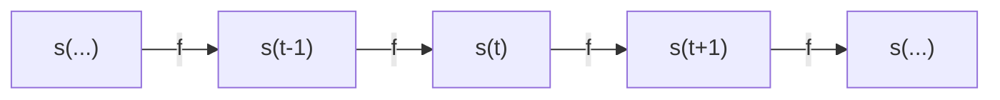

In this post we will review the very basics of Recurrent Neural Networks. What are they, the math behind it and how they can be used. 

!
Recurrent neural networks or RNNs are a family of [[Neural Networks]] for processing sequential data. To go from multilayer networks to recurrent networks, we need to take advantage of one of the early ideas from the 1980s: **sharing parameters** across different parts of a model. 

[alt text](image.png)

A traditional fully connected feedforward network would have separate parameters for each input feature. By comparison, a RNN shares **the same weights across several time steps**
{:.notice--info}

Unlike traditional feedforward NN, RNNs have connections that form cycles, allowing them to maintain a form of "memory" from previous inputs. 
The classical form of a dynamical system, which captures the essence of an RNN is the following: 

$$
s^{(t)} = f(s^{(t-1)}; \theta) \tag{1}
$$

Where:

- $s^{(t)}$  is the hidden state at time step  $t$ ,

- $f$  is a nonlinear function (often including a nonlinearity like tanh or ReLU),

- $\theta$  represents the parameters (weights and biases) shared across all time steps.

This equation is recurrent because the definition of **s** at time *t* refers back to the same definition at time $t-1$. 

This would be the 'unfolded' diagram of the RNN where is unrolled over time. 
In a more expanded form, the RNN update equation typically looks like this: 

$$
\begin{equation}
s^{(t)} = f(W_{ss}s^{(t-1)} + W_{xs}x^{(t)} + b_s) \tag{2}
\end{equation}
$$

Where:

- $W_{ss}$​ are the recurrent weights (state-to-state)

- $W_{xs}$​ are the input weights (input-to-state)

- $x^{(t)}$ is the input at time step $t$

- $b_s$ is the bias term

**The tanh function**: In the equation $(1)$ and $(2)$, $f(·)$ is an activation function ($tanh$). It basically serves the purpose of making the RNN capable of seeing non-linear relations and introduces complexity to our model. Without an activation function, the combination $W_{ss} + W_{xs} + b_s$  would remain as a linear transformation of the inputs.    
{:.notice--info}

### The hidden units 
As the name suggest, hidden units are the neurons that are not directly observable in the input or output. They are the neurons that form the network's internal "memory". We can rewrite the state of a hidden unit rewriting equation 1. 

$$
h^{t} = f(h^{(t-1)}, x^{(t)}; \theta) \tag 3
$$

When the RNN is trained to perform a task that requires predicting the future from the past, the network typically learns to use $h^t$ as a kind of **lossy** summary of the task-relevant aspects of the past sequence of inputs.
{:.notice--info} 

#### How are updates at time $t$ performed
For every time step $t$ we have an input value $x^t$ that we use to obtain the hidden unit $h^t$ which contains the "memory" of previous input i.e. $x$ for every time step before $t$ (e.g. $(t-1) ,(t-2), \dots 2, 1$) which is parametrized by a weight matrix $W$. In contrast, the process of $x^t \rightarrow h^t$ the weight matrix $U$ is used.  

At the same time, the graph has to compute the training loss of the recurrent network that maps the input $x^t$ values to a corresponding sequence of outputs $o^t$ values parametrized by a matrix $V$. 

The loss $L^t$ computes $\hat y = \text{softmax}(o)$ and compares this to the target (ground truth) $y(t)$.  

**WHY USING SOFTMAX?**
Well, consider an RNN with a hidden state  $s^{(t)}$  computed at each time step  $t$  by
equation $(2)$, let's put $tanh$ as our $f(·)$ this time, and use $h$ -since it's a hidden unit- for the naming instead of $s$: 

$$
h^{(t)} = \tanh\Big(W_{hh} \, h^{(t-1)} + W_{xh} \, x^{(t)} + b_h\Big) \tag 4
$$
  
Then, the output layer computes the unnormalized scores (also known as **logits**) as:

$$
o^{(t)} = V s^{(t)} + b_y \tag 5
$$

These logits do not yet form a proper **[Probability Distribution]** so they cannot really be compared to the ground truth ($\hat y$) so we apply **[Softmax Function](https://afloresep.github.io/posts/2025/03/softmax/)** to get the normalized probabilities over all possible output classes (e.g. letters in the alphabet) at time $t$. The softmax function is applied then as follows:

$$
\hat{y}^{(t)}_i = \frac{e^{o^{(t)}i}}{\sum_{i=1}^k e^{o^{(t)}_i}} \tag 6
$$

This will transform something like 
  
$$
o^{(t)} = \begin{bmatrix} 2.0 \\ 1.0 \\ 0.1 \end{bmatrix}
$$

into something like   
$$
\hat y^{(t)} = \begin{bmatrix} 0.66 \\ 0.242 \\ 0.09 \end{bmatrix}.
$$

In summary, for each time step we apply the following update equations:

$$
\begin{align}
    {a}^{(t)} &= {b} + {W} {h}^{(t-1)} + {U} {x}^{(t)},  \quad & (6.1) \\
    {h}^{(t)} &= \tanh({a}^{(t)}),  \quad & (6.2) \\
    {o}^{(t)} &= {c} + {V} {h}^{(t)},  \quad & (6.3) \\
    \hat{{y}}^{(t)} &= \text{softmax}({o}^{(t)}),  \quad & (6.4)
\end{align}
$$

To be continued...

