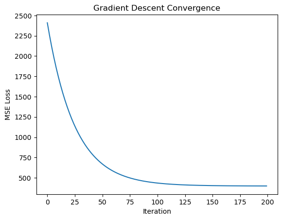

TL;DR: 
Today we are building a simple regression model from scratch using just numpy.


Linear regression is one of the simplest and most widely used supervised machine-learning algorithms. At its core, it assumes a linear relationship between input features $x$ and a real‐valued output $y$, and learns weights $\theta$ so that

$$
h_\theta(x) = \theta^T x
$$


best fits the observed data. In this post we’ll:
	1.	Introduce the notation and cost function.
	2.  The Cost Function	
	3.	Learning $\theta$: Gradient Descent 
	4.	Numpy implementation: predicting house prices.
	5 Visualization 


## Building a Linear Regression from Scratch in Python

### 1. Basic Notation

The main notation we will use is:  
- Input $x\in\mathbb{R}^d$: a vector of $d$ features.
- For a house‐pricing example:

$$
x = \begin{bmatrix} \text{area}\\\text{bedrooms}\\\vdots\end{bmatrix}
$$

- Output $y\in\mathbb{R}$: the target (e.g. price).
- Parameters $\theta\in\mathbb{R}^{d+1}$: which tells us how each parameter will impact the price. 
For example, the number of bedrooms is probably more important to the final price than the number of bathrooms. These weights will tweak the features just enought to get our prediction as close as possible. 


Normally one would write the prediction, often written as $\hat y$ or  ($h_\theta(x)$) as :


$$
h_\theta (x) = \theta_0 + \theta_1x_1 + \theta_2x_2
\,,\ \theta = \begin{bmatrix} \theta_0 \\ \theta_1\\ \theta_2\end{bmatrix}
$$


However, is much simpler to write it as the Dot product (or inner product) of both vectors

$$
    h_\theta(x) = \sum_{i=0}^d \theta_i x_i = \theta^\top x\text{,}
$$


Now, given a training set, how do we pick, or learn, the parameters $\theta$ ?

One reasonable method seems to be to make $h(x)$ close to $y$, at least for the training examples we have. To formalize this, we will define a function that measures, for each value of the $\theta$'s, **how close the $h(x^{(i)})$'s are to the corresponding $y^{(i)}$'s.** 

This is where the Cost Function comes into play
### 2. The Cost Function: Ordinary Least Squares


In **machine learning (ML)**, a **cost function** (also called a loss function) is a measure of **how well the model’s predictions match the actual outcomes or targets**. The cost function gives a numerical value, the **cost** or **loss** that **quantifies** the **error** (or "cost") between the **predicted** values and the **true** values  The goal of training a machine learning model is to minimize this cost function by adjusting the model’s parameters.

#### Loss function
There's multiple way we can compute the loss function - usually written $\mathcal{L} (y_i, \hat y_i$)- where $y_i$ is the **actual** output and $\hat y_i$ is the **predicted** output. One example could be using Cross-entropy as Loss function. 
In Regression models we normally use Mean Squared Error or Mean Averaged Error. For this example we will use MSE. 


$$
\begin{equation}
    J(\theta) = \frac {1}{2m} \sum_{i=1}^n \left( h_\theta(x^{(i)}) - y^{(i)} \right)^2\text{.}
\end{equation}
$$


As you can see, all its doing is computing the sum of squared errors ($\hat y - y$) and dividing them by the total number of samples ($m$). In other words, the **mean** *squared* error. 

>[! tip] Reminder
**Keep in mind that $\hat y$, and $h_\theta(x)$** are the same and all the mean is the prediction of $y$ given $x$ with our current weights which can be calculated by doing $\theta^T x$

Since our objective is to tune the parameters the best we can, we have to *MINIMIZE* this loss. But, how do we update the weights after we calculated the current loss we have? 


### 3. Learning $\theta$ via Gradient Descent 

We want to choose $θ$ so as to minimize $J(θ)$ (the cost function). To do so, we should have some form of search algorithm that starts with some “initial guess” for $θ$, and that repeatedly changes $θ$ to make $J(θ)$ smaller, until hopefully we converge to a value of $θ$ that minimizes $J(θ).$

For instance let's consider only one single sample (n=1). **We do the gradient (derivates) of** $J(\theta)$ w.r.t. weights: 

$$ 
J(\theta) =  \frac {1}{2}(\theta^Tx^{1} -y^1 )^2 
$$

Is then transformed  to

$$
\nabla J(\theta) = \frac {2}{2}(\theta^Tx^{1} -y^1 )x^1
$$

So now, the algorithms updates $\theta$ for all values of $j = 0, . . . , n.)$.

$$
\theta_j := \theta_j - \alpha(\theta^Tx^{1} -y^1 )x^1
$$

Here, $α$ is called the **[[learning rate]]**. This is a very natural algorithm that repeatedly takes a step in the direction of steepest decrease of $J$

We’d derived the LMS rule for when there was only a single training example. There are two ways to modify this method for a training set of more than one example. 
- The first is replace it **repeating until convergence**: 

$$
\theta_j := \theta_j - \alpha \sum^m_{i=1}(\theta^Tx^{i} -y^i )x^i
$$

This method looks at every example in the entire training set on every step, and is call is called **batched gradient descent**

In code, a single gradient‐descent update looks like:

```python
error = X_train.dot(self.W) - y_train
grad  = (2 / X_train.shape[0]) * X_train.T.dot(error)
self.W -= self.lr * grad
```

Repeating for `n_iterations` gradually reduces the loss.

### 4.	Numpy implementation: predicting house prices.


So, now that we've covered the theory, let's code it. 

First, we will initialize our class and initialize the values: `learning r`ate and `number of iterations`

```python
class LinearRegression:
    """Linear model.

    Args:
        n_iterations (float): The number of training iterations the algorithm will tune the weights for.
        learning_rate (float): The step length that will be used when updating the weights.
        gradient_descent (boolean): True or false depending if gradient descent should be used when training. If 
        false then we use batch optimization by least squares.
    """

    def __init__(self, n_iterations:int=100,
                 lr:float=0.01)
       self.n_iterations = n_iterations
       self.lr = lr 
       self.W = None

       # These two are just for plotting lates
       self.loss_over_time = []
       self.loss_over_time= []

```

We also will initialize some random weights. There's different ways of doing this but we can just use a random uniform distribution for it.

```python
    def initialize_weights(self, n_features):
        """Initialize weights randomly 

        Args:
            n_features (int): Number of features in X
        """
        limit = 1 / math.sqrt(n_features)
        self.W = np.random.uniform(-limit, limit, (n_features, ))

```

Now the training part. Here we will perform Gradient Descent. Once again all we are doing is predicting values (`y_hat)` based on our current weights and our training data, then computing the loss (i.e. how far our prediction is at the moment) based on the error (difference between predicted values and actual values) and updating our weights using the gradient of the loss we measured.

In code could be something like this: 
```python
    def fit(self, 
            X_train: np.ndarray, 
            y_train: np.ndarray):

        # Initialize randomly W
        self.initialize_weights(X_train.shape[1])

        # Gradient Descent
        for _ in range(self.n_iterations):

            # Prediction
            y_hat = np.dot(self.W, X_train.T)

            # We append the current loss to plot later on
            self.loss_over_time.append(mean_squared_error(y_train, y_hat))

            # Weights are updatated by - lr(error).dot X_train
            error = y_hat - y_train
            w_grad = (2 / X_train.shape[0])* X_train.T.dot(error)
            
            self.W -= self.lr * w_grad
            self.w_over_time.append(float(self.W))
```


#### 5. Visualization 

How well does our model perform? 

Let's get some data from scikit-learn

```python 
from sklearn.datasets import make_regression

X, y = make_regression(n_samples=10000, n_features=1, noise=20)
X_train, X_test, y_train, y_test = train_test_split(X, y, test_size=0.3)
```


Now we fit our model 
```python
lreg = LinearRegression(n_iterations=200)
lreg.fit(X_train, y_train)
```

And we see how the MSE changed for each iteration!




We can also plot how our parameters (the slope of the line) changed over time


You can find the whole code and some other from scratch implementations at my github: https://github.com/afloresep/Machine-Learning-From-Scratch 